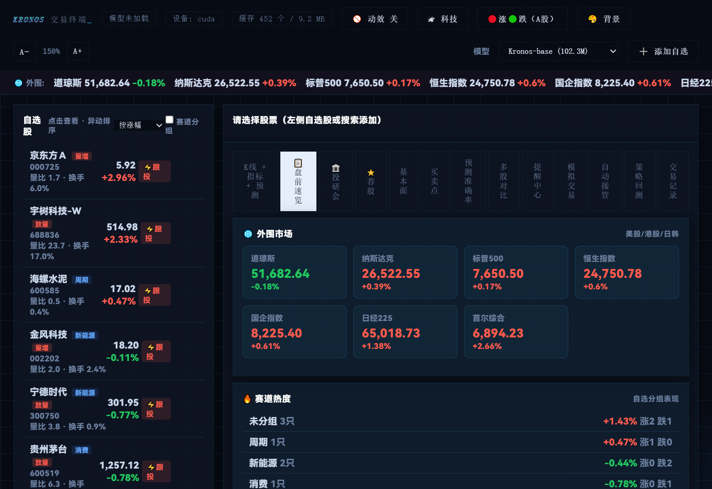
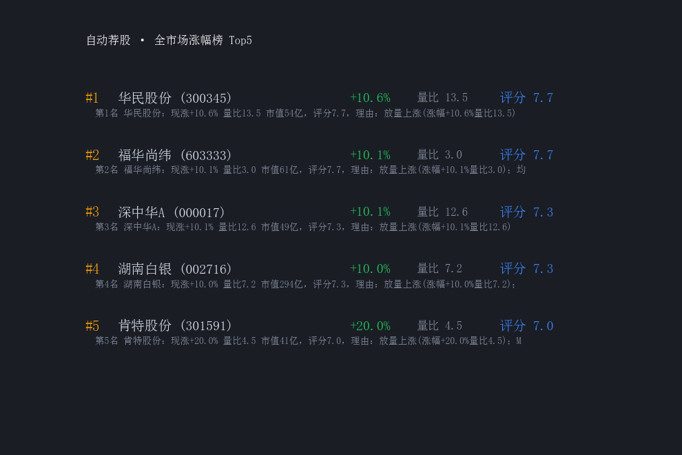
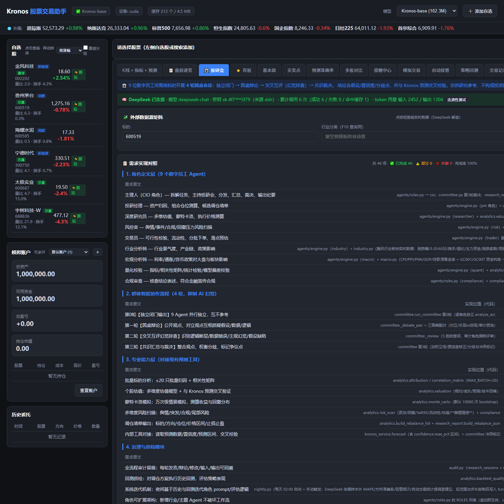

# Kronos 股票交易助手

<p align="center">
  
  
  
  
  
  
</p>

基于 [Kronos 金融 K 线基础大模型](https://github.com/shiyu-coder/Kronos)（AAAI 2026，45+ 全球交易所数据训练）的本地股票分析 + 模拟交易工作台。

> **免责声明**：本项目仅供学习研究，所有预测/信号/荐股均由统计模型生成，不构成任何投资建议。模拟交易为虚拟资金。

## 📸 界面预览

> 真实运行数据截图（来自 `docs/screenshots/`）：

| 盘前速览（外围+赛道+异动+荐股+要闻） | 自动荐股排行榜 |
|---|---|
|  |  |

| 需求实现对照（投研智能体逐条对照） |
|---|
|  |

> 其他界面：**K线+预测**（多周期蜡烛图 + 指标 + Kronos 预测误差带）、**模拟交易**（多账户/持仓/委托/自动接管）、**基本面**（估值/财务/公告）、**提醒中心**（微信推送/异动预警）。

> 💡 **深链接**：`http://localhost:7071/?tab=research&req=1` 可直接打开「投研会」标签并展开需求对照表；
> 完整对照表见 [`需求对照表.md`](需求对照表.md)。

---

## ✨ 功能全景

| 模块 | 能力 |
|---|---|
| 🏛️ **投研智能体** | **9 位数字员工**（主理人/投研经理/深度研究员/风控官/交易员/行业/宏观/量化校验/合规审查），**4 轮圆桌会议**（独立闭门→圆桌辩论→交叉互评幻觉排查→共识裁决）抑制 AI 幻觉；专业层含相关性矩阵/归因/多维估值/**蒙特卡洛 10000 次**/风险扫描/回测质检；输出**会议纪要 + 分析报告 + JSON 调仓清单**，全流程审计留痕。**页内「📋 需求实现对照」**逐条列出 35 项需求 → 实现位置 → 网页可见位置 → 完成状态（29 ✅ / 4 ⚠️ / 2 ❌，缺口如实标注） |
| 外围市场 | 美股三大指数 / 恒指 / 国企指数 / 日经225 / KOSPI 实时，顶部常驻条 |
| 赛道分组 | 自选股按 AI/新能源/消费/周期分组，每组显示热度（均涨/涨跌家数/领涨股） |
| 行情与指标 | 日线 + 1/5/15/30/60 分钟线，MA/MACD/RSI/KDJ/BOLL 叠加 |
| Kronos 预测 | 未来 30/60/120 根预测 + 置信误差带 + 历史准确率提示 |
| 买卖点 | 操作建议/买入区间/目标价/止损价 + 接近买点/止损/目标提前预警（可推微信） |
| 自动荐股 | 全 A 股涨幅榜扫描，四维打分排行榜（动量/技术/基本面/Kronos），一键加自选 |
| 预测准确率 | 滚动样本外验证：MAE/RMSE/MAPE/方向准确率 |
| 基本面 | 公司概况/估值(PE/PB)/财务摘要/公司公告 |
| 模拟交易 | 多账户、A股规则（整手/佣金/印花税）、快速下单、一键跟投（含风控） |
| 自动接管 | 规则引擎自动买卖（涨幅/量比/信号触发），执行日志 |
| 提醒中心 | 买卖点触发/异动监控/微信推送（Server酱/PushPlus） |
| 每日要闻 | 每日 5 条重要财经新闻 |
| 盘前速览 | 外围+赛道+异动+荐股+要闻 五大板块聚合主页 |

## 快速开始

### 环境要求
- Windows 10/11，Python 3.12
- NVIDIA GPU + CUDA（可选，无 GPU 自动 CPU）
- 可访问腾讯行情 / 新浪财经 / 东财数据中心（国内网络）

### 安装

```bash
# 1. 克隆本仓库
git clone <仓库地址>
cd kronos-trading-app

# 2. 创建虚拟环境并安装依赖
python -m venv .venv
.venv\Scripts\activate
pip install -r requirements.txt -r trading-app\requirements.txt

# 3. 下载 Kronos 模型权重（官方 HuggingFace，约 400MB）
#    把 Kronos-base 和 Kronos-Tokenizer-base 放到 models/ 目录

# 4. 启动
双击 启动交易APP.bat   # 或: cd trading-app && python app.py
```

浏览器打开 http://localhost:7071

## 使用说明

> 界面为中文，顶部导航为各功能页签（tab）。以下按日常使用顺序说明。

### 1. 添加自选股
- 右上角 **➕ 添加自选**，输入 **6 位代码或股票名称**（如 `600585`、`海螺水泥`、`比亚迪`），自动解析入库
- 左栏自选列表：点击进入分析；悬停 🏷 可设赛道分组、✕ 删除；表现好的股票（涨/放量）旁有 **⚡跟投** 按钮

### 2. 盘前速览（📋 tab）—— 每天开盘前打开
- 一次看全：**外围市场**（美股/恒指/日韩）→ **赛道热度**（自选分组均涨/涨跌家数）→ **自选异动** → **荐股 Top5** → **每日要闻**
- 看完定节奏：外围红绿 → 哪个赛道在动 → 看荐股/异动挑候选

### 3. K线 + 指标 + 预测（📈 tab）
- 周期切换：日线 / 60/30/15/5/1 分钟
- 指标叠加：MA5/10/20/60、BOLL、MACD、RSI、KDJ
- **Kronos 预测**：紫色曲线为未来 30/60/120 根预测，含 ±15% 误差带与准确率提示
- 右侧 **📄 导出报告**：下载预测明细 CSV

### 4. 自动荐股（⭐ tab）—— 全市场扫描
- 从全 A 股涨幅榜（40+ 候选）四维打分（动量/技术/基本面/Kronos），排 Top 3/5/8
- 每张卡片：排名/涨跌幅/量比/评分/摘要；**➕ 加入自选** 一键入库
- 点击卡片 → 详情弹窗（打分明细/理由/K线/买卖点/基本面）
- 页面下方：**每日要闻**（5 条财经新闻，可点原文）

### 5. 基本面（📋 tab）
- 公司概况 / 估值快照（PE/PB/市值）/ 最近 4 季度财务摘要 / 公司公告（消息面）

### 6. 买卖点（🎯 tab）
- 自动给出：操作建议（买/卖/持有/观望）、买入区间、目标价、止损价、支撑/压力位
- **提前预警**：现价距买点/止损/目标 1.5% 内时显示警告条（🔔/⚠️/🎯）

### 7. 模拟交易（💰 tab）
- 多账户：左上角下拉切换 / ➕ 创建（独立资金/持仓/委托）
- 快速下单：交易页直接输入代码 → 载入 → 填价格数量下单（A股规则：买入整手、佣金万三最低5元、卖出印花税万五）
- **一键跟投**：自选里表现好的股票 ⚡跟投 → 按现价买入（默认 10% 资金，单票上限 20% 总资产），自动生成止损计划

### 8. 自动接管（🤖 tab）
- 新建规则：选股票 + 触发条件（涨幅≥/跌幅≤/量比≥/量价信号）+ 动作（买/卖）+ 数量/金额 + 执行账户
- 后台每 60 秒检查，触发自动下单；可启停/删除；执行日志可查
- ⚠️ 模拟资金，先跑通策略再考虑放大

### 9. 提醒中心（🔔 tab）
- **微信推送**：填 Server酱 SendKey 或 PushPlus token → 启用 → 测试推送
  - Server酱：https://sct.ftqq.com 微信扫码获取
  - PushPlus：https://www.pushplus.plus 扫码获取
- **买卖点计划**：为自选股生成计划（买入区间/目标/止损）
- **异动监控**：涨幅≥3% 或量比≥2.5 触发大幅拉升/放量提醒（可推微信）
- **提前预警**：接近买点/止损/目标自动提示
- 触发历史全部记录在页面

### 10. 策略回测（📈 tab）
- 4 种策略：综合信号 / 均线金叉死叉 / MACD金叉死叉 / RSI反转
- 输出：总收益/年化/最大回撤/胜率/交易明细/对比基准

### 11. 投研智能体（🏛️ tab）—— 9 位数字员工开 4 轮圆桌会
- 输入标的（最多 20 只，留空=用自选股），点「🏛️ 召开投研会」
- 4 轮流程：**第0轮 独立闭门输出 → 第1轮 圆桌辩论 → 第2轮 交叉互评（幻觉排查）→ 第3轮 主理人裁决**
- 专业分析层：相关性矩阵 / 归因分析 / 多维估值 / **蒙特卡洛 10000 次** / 风险扫描 / 回测质检
- 输出物：**会议纪要 (MD)** / **综合分析报告 (MD)** / **结构化调仓清单 (JSON, `kronos.rebalance.v1`)**
- 🛡️ 合规审查：10 条禁词自动核查 + 假设/置信度标注检查；与 Kronos 预测冲突时 **🔴 红框高亮**
- **📋 需求实现对照**（本 tab 第一块面板）：把需求清单逐条列出——需求原文 / 实现位置 / 网页可见位置 / 状态，
  共 35 项（✅ 29、⚠️ 4、❌ 2），**未完成项如实标注缺口原因**，点「展开 / 收起」查看。
  也可用深链接直接打开：`http://localhost:7071/?tab=research&req=1`

## 自动化测试

```bash
cd trading-app
python tests/regression.py          # 核心 API 回归（50 项）
python tests/edge_cases.py          # 边界情况（20 项）
python tests/data_correctness.py    # 数据数学核验（16 项）
python tests/performance.py         # 性能/缓存/并发（15 项）
python tests/security.py            # 安全健壮性（18 项）
python tests/stability.py           # 稳定性长跑（11 项）
```

## 项目结构

```
kronos-trading-app/
├── model/                  # Kronos 模型源码（官方）
├── trading-app/
│   ├── app.py              # Flask 后端（40+ API）
│   ├── market.py           # 行情（腾讯/新浪，绕代理）
│   ├── kronos_service.py   # Kronos 预测服务（多模型支持）
│   ├── recommend.py        # 全市场荐股 + 每日要闻
│   ├── fundamentals.py     # 基本面分析
│   ├── buysell.py          # 买卖点引擎
│   ├── alerts.py           # 提醒/预警引擎
│   ├── auto_trade.py       # 自动接管引擎
│   ├── account.py          # 多账户模拟交易
│   ├── backtest.py         # 策略回测
│   ├── requirements_map.py # 需求清单逐条对照表（供页内「需求实现对照」渲染）
│   ├── agents/             # 9 位数字员工角色定义 + 规则引擎 + LLM 适配层
│   ├── committee.py        # 4 轮圆桌会议编排（辩论/互评/裁决）
│   ├── analytics.py        # 相关性/归因/估值/蒙特卡洛/风险扫描/调仓清单
│   ├── audit.py            # 全流程审计留痕
│   ├── compliance.py       # 合规审查（禁词/假设标注）
│   ├── research_report.py  # 会议纪要 / 分析报告 / JSON 调仓清单
│   ├── tests/              # 自动化测试套件（130 项）
│   └── templates/          # 前端界面
├── 需求对照表.md           # 需求 → 实现 → 网页位置 逐条对照
├── 启动交易APP.bat         # 一键启动
└── 运行测试.bat            # 一键跑全部测试
```

## 相关资源

- Kronos 官方仓库：https://github.com/shiyu-coder/Kronos
- Kronos 论文：https://arxiv.org/abs/2508.02739
- 模型权重：https://huggingface.co/NeoQuasar

## ❓ 常见问题

**Q：没有 GPU 能跑吗？**
能。程序自动检测，无 CUDA 时用 CPU 推理（预测会慢些，功能一致）。

**Q：模型权重在哪里下载？**
本项目不包含权重（约 400MB）。运行前从 HuggingFace 下载 `Kronos-base` 和 `Kronos-Tokenizer-base` 放到 `models/` 目录；国内网络可设 `HF_ENDPOINT=https://hf-mirror.com` 走镜像。

**Q：数据是哪里的？**
腾讯行情（K线/报价/量比）+ 新浪财经（涨幅榜/要闻）+ 东财数据中心（财务/公告），均为免费公开接口，本地缓存。非券商级数据，有延迟。

**Q：微信推送怎么配？**
提醒中心填 Server酱 SendKey 或 PushPlus token 即可，两者都免费、微信扫码获取。

**Q：自动接管会真实下单吗？**
不会。所有交易都在模拟账户（虚拟资金）中执行，不接任何券商实盘。

**Q：为什么预测准确率不高？**
Kronos 是统计模型，方向准确率约 50%（模型自检），数值预测偏乐观——项目内置"预测准确率"tab 展示真实误差，请理性看待预测。

## 📄 License

MIT（Kronos 模型部分遵循其原仓库 License，见 Kronos-README.md）

## 重要提醒

1. 预测可靠性：Kronos 是统计模型，方向准确率有限（自检约 50%），数值预测偏乐观，请勿据此实盘操作。
2. 数据源：腾讯/新浪/东财公开接口，非券商级数据，有缓存。
3. 不接实盘：本项目的模拟交易/自动接管均为虚拟资金，不涉及真实交易。